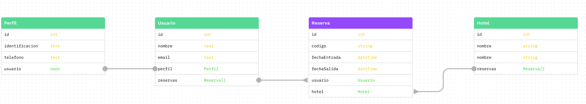
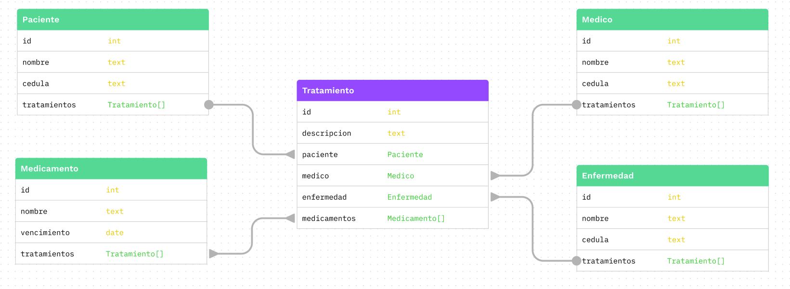

1. **De acuerdo al siguiente diagrama Entidad-Relación, construya los queries de creación de tablas en SQL.**

2. **De acuerdo al siguiente diagrama Entidad-Relación, construya los queries de creación de tablas en SQL.**

