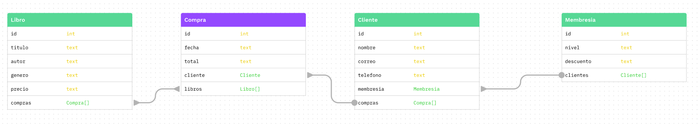
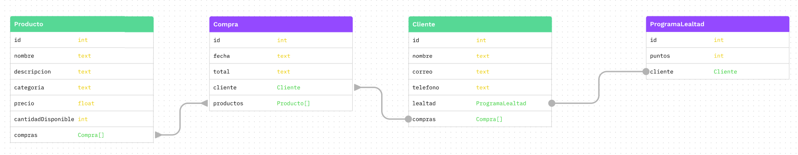

1. **De acuerdo al siguiente diagrama Entidad-Relación, construya los queries de creación de tablas en SQL.**
   

```sql

CREATE TABLE "Perfil" (
    id INT PRIMARY KEY,
    identificacion TEXT,
    telefono TEXT,
    "usuarioId" INT UNIQUE,
    FOREIGN KEY ("usuarioId") REFERENCES "Usuario"(id)
);

CREATE TABLE "Usuario" (
    id INT PRIMARY KEY,
    nombre TEXT,
    email TEXT,
    "perfilId" INT,
    FOREIGN KEY (perfilId) REFERENCES "Perfil"(id)
);

CREATE TABLE "Hotel" (
    id INT PRIMARY KEY,
    nombre TEXT
);

CREATE TABLE "Reserva" (
    id INT PRIMARY KEY,
    codigo TEXT,
    "fechaEntrada" DATETIME,
    "fechaSalida" DATETIME,
    "usuarioId" INT,
    "hotelId" INT,
    FOREIGN KEY ("usuarioId") REFERENCES "Usuario"(id),
    FOREIGN KEY ("hotelId") REFERENCES "Hotel"(id)
);

```

---

2. **De acuerdo al siguiente diagrama Entidad-Relación, construya los queries de creación de tablas en SQL.**
   

```sql
CREATE TABLE "Paciente" (
    id INT PRIMARY KEY,
    nombre TEXT,
    cedula TEXT
);

CREATE TABLE "Medico" (
    id INT PRIMARY KEY,
    nombre TEXT,
    cedula TEXT
);

CREATE TABLE "Enfermedad" (
    id INT PRIMARY KEY,
    nombre TEXT
);

CREATE TABLE "Medicamento" (
    id INT PRIMARY KEY,
    nombre TEXT,
    vencimiento DATE
);

CREATE TABLE "Tratamiento" (
    id INT PRIMARY KEY,
    descripcion TEXT,
    "pacienteId" INT,
    "medicoId" INT,
    "enfermedadId" INT,
    FOREIGN KEY ("pacienteId") REFERENCES "Paciente"(id),
    FOREIGN KEY ("medicoId") REFERENCES "Medico"(id),
    FOREIGN KEY ("enfermedadId") REFERENCES "Enfermedad"(id)
);

CREATE TABLE "Medicamento_Tratamiento" (
    "medicamentoId" INT,
    "tratamientoId" INT,
    PRIMARY KEY ("medicamentoId", "tratamientoId"),
    FOREIGN KEY ("medicamentoId") REFERENCES "Medicamento"(id),
    FOREIGN KEY ("tratamientoId") REFERENCES "Tratamiento"(id)
);
```

---

3. **Construya el diagrama Entidad-Relación basado en la siguiente descripción de negocio:**

**_Descripción del negocio:_**

Una pequeña librería llamada "Librería del Saber" vende libros de diferentes géneros. La librería tiene un inventario de libros, cada uno con un título, autor, género y precio. Los clientes pueden realizar compras y cada compra está asociada a un cliente específico. Cada cliente tiene un nombre, un correo electrónico y un número de teléfono. La librería también ofrece un programa de membresía, donde los miembros reciben descuentos en sus compras. Cada membresía tiene un nivel (por ejemplo, básico, plata, oro) que determina el porcentaje de descuento.

**_Entidades sugeridas:_**

- **_Libro_**: id, título, autor, género, precio
- **_Cliente_**: id, nombre, correo electrónico, teléfono
- **_Compra_**: id, fecha, total, clienteId
- **_Membresía_**: id, nivel, descuento

**_Relaciones:_**

- Un cliente puede realizar múltiples compras.
- Cada compra está asociada a un solo cliente.
- Un cliente puede tener una membresía, pero no es obligatorio.
- Cada libro puede ser comprado en múltiples compras.



---

4. Construya el diagrama Entidad-Relación basado en la siguiente descripción de negocio:

**_Descripción del negocio:_**

Una tienda de ropa llamada "Moda Actual" vende una variedad de prendas de vestir para hombres, mujeres y niños. La tienda tiene un inventario de productos, cada uno con un nombre, descripción, categoría, precio y cantidad disponible. Los clientes pueden realizar compras y cada compra está asociada a un cliente específico. Cada cliente tiene un nombre, un correo electrónico y un número de teléfono. La tienda también ofrece un programa de lealtad, donde los clientes pueden acumular puntos por cada compra, que pueden ser canjeados por descuentos en futuras compras.

**_Entidades sugeridas:_**

- **_Producto_**: id, nombre, descripción, categoría, precio, cantidadDisponible
- **_Cliente_**: id, nombre, correo electrónico, teléfono
- **_Compra_**: id, fecha, total, clienteId
- **_Programa de Lealtad_**: id, puntosAcumulados, clienteId

**_Relaciones:_**

- Un cliente puede realizar múltiples compras.
- Cada compra está asociada a un solo cliente.
- Un cliente puede acumular puntos a través del programa de lealtad, pero no es obligatorio.
- Cada producto puede ser comprado en múltiples compras.
  
