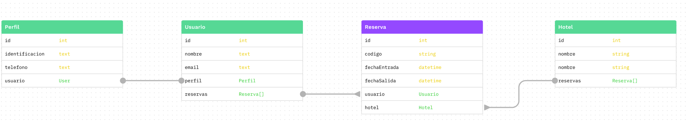

1. **De acuerdo al siguiente diagrama Entidad-Relación, construya los queries de creación de tablas en SQL.**
   

```sql

CREATE TABLE "Perfil" (
    id INT PRIMARY KEY,
    identificacion TEXT,
    telefono TEXT,
    "usuarioId" INT UNIQUE,
    FOREIGN KEY ("usuarioId") REFERENCES "Usuario"(id)
);

CREATE TABLE "Usuario" (
    id INT PRIMARY KEY,
    nombre TEXT,
    email TEXT,
    "perfilId" INT,
    FOREIGN KEY (perfilId) REFERENCES "Perfil"(id)
);

CREATE TABLE "Hotel" (
    id INT PRIMARY KEY,
    nombre TEXT
);

CREATE TABLE "Reserva" (
    id INT PRIMARY KEY,
    codigo TEXT,
    "fechaEntrada" DATETIME,
    "fechaSalida" DATETIME,
    "usuarioId" INT,
    "hotelId" INT,
    FOREIGN KEY ("usuarioId") REFERENCES "Usuario"(id),
    FOREIGN KEY ("hotelId") REFERENCES "Hotel"(id)
);

```

2. **De acuerdo al siguiente diagrama Entidad-Relación, construya los queries de creación de tablas en SQL.**
   

```sql
CREATE TABLE "Paciente" (
    id INT PRIMARY KEY,
    nombre TEXT,
    cedula TEXT
);

CREATE TABLE "Medico" (
    id INT PRIMARY KEY,
    nombre TEXT,
    cedula TEXT
);

CREATE TABLE "Enfermedad" (
    id INT PRIMARY KEY,
    nombre TEXT
);

CREATE TABLE "Medicamento" (
    id INT PRIMARY KEY,
    nombre TEXT,
    vencimiento DATE
);

CREATE TABLE "Tratamiento" (
    id INT PRIMARY KEY,
    descripcion TEXT,
    "pacienteId" INT,
    "medicoId" INT,
    "enfermedadId" INT,
    FOREIGN KEY ("pacienteId") REFERENCES "Paciente"(id),
    FOREIGN KEY ("medicoId") REFERENCES "Medico"(id),
    FOREIGN KEY ("enfermedadId") REFERENCES "Enfermedad"(id)
);

CREATE TABLE "Medicamento_Tratamiento" (
    "medicamentoId" INT,
    "tratamientoId" INT,
    PRIMARY KEY ("medicamentoId", "tratamientoId"),
    FOREIGN KEY ("medicamentoId") REFERENCES "Medicamento"(id),
    FOREIGN KEY ("tratamientoId") REFERENCES "Tratamiento"(id)
);
```
